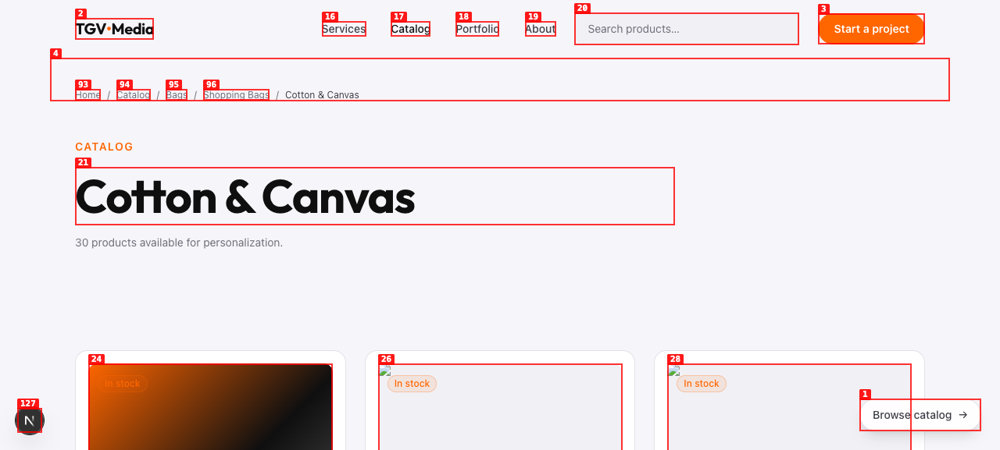
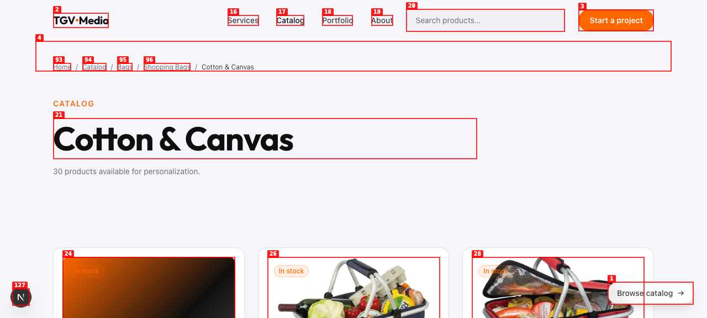
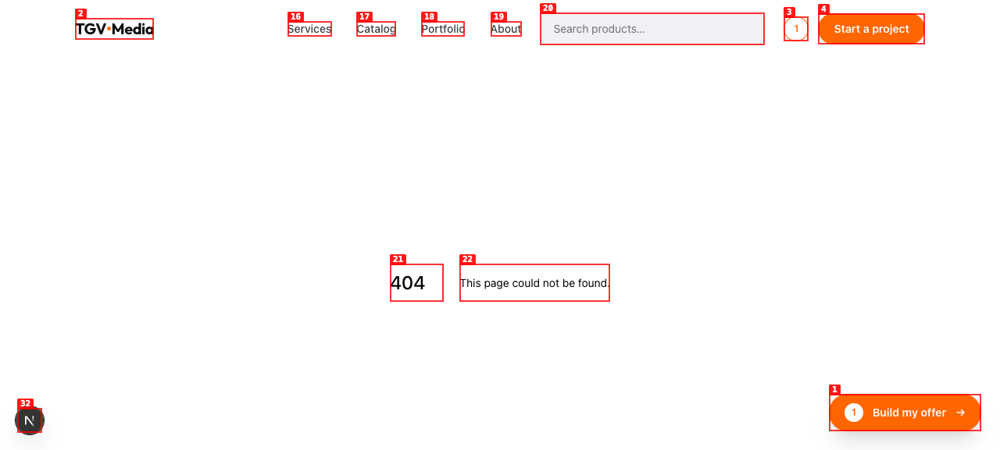
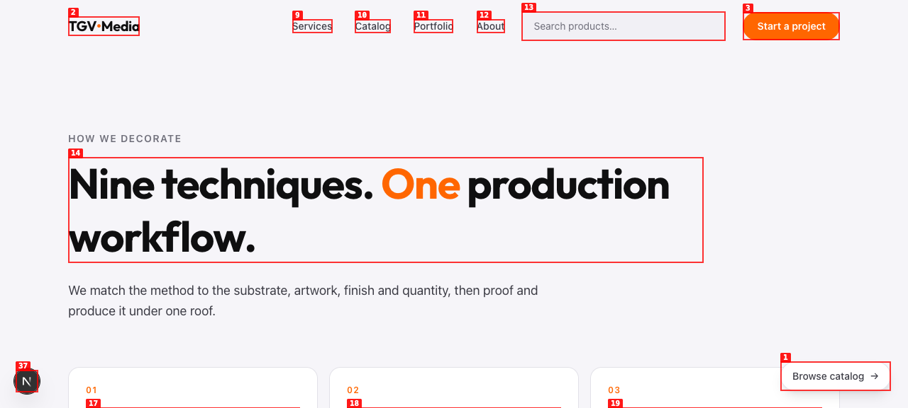

# Dogfood Report: TGV Media

| Field | Value |
|-------|-------|
| **Date** | 2026-08-14 |
| **App URL** | http://localhost:3000 |
| **Session** | tgv-photo-audit |
| **Scope** | Full public website, with emphasis on product and portfolio photos |

## Summary

| Severity | Count |
|----------|-------|
| Critical | 0 |
| High | 1 |
| Medium | 1 |
| Low | 2 |
| **Total** | **4** |

## Issues

### ISSUE-001: Macma product photos fail on every visible product card

| Field | Value |
|-------|-------|
| **Severity** | high |
| **Category** | visual / functional / console |
| **URL** | http://localhost:3000/catalog/bags/shopping-bags/cotton-and-canvas |
| **Repro Video** | N/A (visible on load) |

**Description**

Macma-backed product cards point at local `/catalog/macma/{product}/00.webp` files that do not exist. Direct source requests return 404 and Next.js image optimization returns 400, leaving broken-image placeholders. The fixture-backed first card renders its fallback, confirming this is specific to supplier image data/storage.

**Resolution**

Resolved. The current generated catalog now uses its verified `https://macma.ro/products/**` source URLs, and scheduled syncs always use `--skip-images`. The same browser checks now report zero broken images on both product cards and product detail/gallery views.

**Repro Steps**

1. Navigate to the Cotton & Canvas leaf category.
2. Observe that visible Macma cards after the fixture card have broken image placeholders.
3. Confirmed in the browser network log: eight visible `/_next/image?...` requests return HTTP 400.

---

### ISSUE-002: Published navigation links led to nonexistent routes

| Field | Value |
|-------|-------|
| **Severity** | medium |
| **Category** | functional / navigation |
| **URL** | `/techniques`, `/privacy`, `/terms` |
| **Repro Video** | N/A (visible on navigation) |

**Description**

The homepage linked to a nonexistent Techniques route, while the footer and sitemap advertised Privacy and Terms pages that were not implemented. Each destination rendered the default 404 page.

**Resolution**

Resolved. A Techniques page was added from the existing technique data. Nonexistent legal destinations are no longer presented until real approved policy content exists.

---

### ISSUE-003: Footer exposed placeholder contact and social actions

| Field | Value |
|-------|-------|
| **Severity** | low |
| **Category** | content / functional |
| **URL** | Site-wide footer |
| **Repro Video** | N/A (visible on load) |

**Description**

The footer showed `Address: TBD`, `Email: TBD`, and `Phone: TBD`. Four social icons all linked to `#`, which changed no meaningful state.

**Resolution**

Resolved. The footer uses the verified studio address, email and phone shown on the Contact page, and placeholder social actions are hidden until real destinations are supplied.

---

### ISSUE-004: Missing page semantics and metadata caused polish/accessibility defects

| Field | Value |
|-------|-------|
| **Severity** | low |
| **Category** | accessibility / content / console |
| **URL** | `/contact`, `/offer`, site icon |
| **Repro Video** | N/A (visible on load) |

**Description**

The Contact page had no H1, the Offer page inherited the homepage title, and the browser requested a missing favicon.

**Resolution**

Resolved. Contact now has one semantic H1, Offer has route-specific metadata, and the app publishes a branded SVG icon. A clean browser session reports no 4xx requests across these routes.

---
